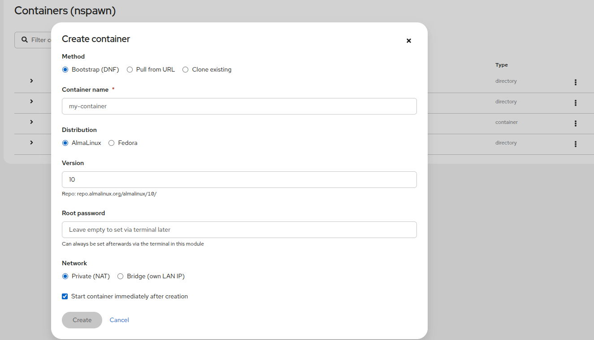

# cockpit-nspawn

A Cockpit module for managing systemd-nspawn containers through a clean web UI — because apparently nobody else made one.



## The Story Behind This

If you have ever tried to find a Cockpit module for managing systemd-nspawn containers, you already know what happens: you find nothing. A few old forum threads, some "wouldn't that be nice" comments, and then silence.

Honestly, I find this strange. systemd-nspawn is a fantastic, lightweight container solution that ships with every modern systemd-based Linux system. No daemon, full systemd support inside the container, perfect for testing and isolation. And yet — no Cockpit UI. Not even a basic one.

So I built one.

I should be transparent: I am not a developer. I am a Linux sysadmin, an IT consultant, and what some might generously call a "datanisse" — a Scandinavian term for someone who lives and breathes computers but is not necessarily paid to write code. What I *am* paid to do is make Linux systems work, and I work far too much of the time already.

This module was built using **Claude Code**, which turned out to be a remarkable tool for exactly this kind of project — someone who knows what they want technically but needs help getting from idea to working software. If you are a sysadmin who has ever thought "I could specify this perfectly but couldn't code it from scratch", Claude Code is worth exploring.

## What It Does

- Lists all nspawn containers and machine images
- Start, stop, and force-terminate containers
- Open a shell inside a running container
- Stream live logs from the container via journald
- Create containers via DNF bootstrap (AlmaLinux, Fedora), URL pull, or clone
  - Optional desktop environment at bootstrap: XFCE, KDE Plasma, or GNOME (X11 + xrdp), Weston (Wayland RDP), or KDE Plasma headless (Wayland VNC)
  - Network mode: Bridge (own LAN IP) or NAT (shared NetworkManager bridge, 10.99.0.1/24)
  - Autostart at boot, root password, optional autostart
- Change network mode (NAT ↔ Bridge) on stopped containers
- Open display — shows RDP connection info and downloads a `.rdp` file that opens directly in Windows Remote Desktop (mstsc.exe), Remmina, or xfreerdp. RDP is encrypted by default.
- Export containers as tarballs with direct browser download streaming
- Enable/disable autostart at boot per container
- Interface available in English, Swedish, German, French, and Spanish

## Desktop Environment Support

> **⚠️ Experimental** — Desktop environment bootstrap is under active development and should be considered experimental. Functionality varies by distribution and may not work in all configurations.

Desktop environments are bootstrapped via DNF and use **xrdp** (X11-based DEs), **Weston** (Wayland RDP), or **labwc + wayvnc** (Wayland VNC) for remote access. No GPU or physical display is required.

| Distribution | XFCE | KDE Plasma | GNOME | Weston (Wayland RDP) | KDE Plasma (Wayland VNC) |
|---|---|---|---|---|---|
| AlmaLinux 9 | ✅ tested | ✅ tested | ✅ tested | ❌ not offered | ❌ not offered |
| AlmaLinux 10 | ❌ not in EPEL 10 yet | ❌ not in EPEL 10 yet | ❌ not in EPEL 10 yet | ❌ not offered | ❌ not offered |
| Fedora 43 | ✅ tested | ❌ Plasma 6 is Wayland-only | ❌ GNOME 47+ is Wayland-only | ✅ tested | ❌ not offered |
| Fedora 44 (Beta) | ❌ | ❌ | ❌ | 🔲 untested | ✅ tested |

KDE Plasma 6 and GNOME 47+ (Fedora 40+) dropped X11 support and are incompatible with xrdp's X11 backend. XFCE remains X11-based and works with xrdp on Fedora 43. For Fedora 40+ there are two Wayland-native options:

- **Weston (port 3389, RDP)** — minimal compositor, terminal only, RDP encrypted by default
- **KDE Plasma (port 5900, VNC)** — full KDE Plasma 6 desktop, headless via labwc + wayvnc

### KDE Plasma Headless VNC — How It Works

Getting a full KDE Plasma desktop to run headlessly in a container — no GPU, no physical display, no display manager — turned out to be a more interesting problem than expected. The final architecture took several iterations to get right.

```
labwc  (wlroots headless compositor, wayland-0)
├── wayvnc  (VNC server, port 5900 — captures labwc output)
└── kwin_wayland  (nested fullscreen window, wayland-1)
    ├── kactivitymanagerd
    └── plasmashell  (panel docked correctly at screen edge)
```

**Why two compositors?** This is the key insight. KDE Plasma's panel uses `plasma_surface` — a KDE-specific Wayland protocol extension — to tell the compositor "anchor me to the bottom edge of the screen". Only kwin_wayland implements this protocol. Without it, the panel has no way to dock, and floats in the center of the screen as a regular window.

The naive approach — labwc + plasmashell directly — fails for exactly this reason. labwc is a clean wlroots compositor, but it does not implement KDE's protocol extensions.

The solution is to run kwin_wayland as a **nested compositor** inside labwc, as a fullscreen window. kwin provides all KDE Wayland protocols (including `plasma_surface` and `PlasmaWindowManagement`), so plasmashell positions its panel correctly. wayvnc, which requires the wlroots `wlr-screencopy` protocol that kwin does not implement, attaches to labwc — the outer compositor — and captures the entire screen, including the kwin session running fullscreen inside it.

The four components:

1. **[labwc](https://github.com/labwc/labwc)** — lightweight wlroots-based Wayland compositor. Runs headlessly with `WLR_BACKENDS=headless`. Provides the `wlr-screencopy` protocol that wayvnc needs.
2. **[wayvnc](https://github.com/any1/wayvnc)** — VNC server for wlroots compositors. Listens on port 5900, captures labwc's framebuffer.
3. **kwin_wayland** — KDE's own Wayland compositor, started as a nested client inside labwc (`--width 1920 --height 1080 --fullscreen`). Implements all KDE-specific protocols. Creates its own Wayland socket (`wayland-1`) for the KDE session.
4. **plasmashell + kactivitymanagerd** — connect to kwin's socket and get a properly functioning desktop with a docked panel, working task manager, and correct window management.

SDDM and plasmalogin both require `/dev/tty1` which does not exist in nspawn containers, so the session is managed directly via systemd. krdp (KDE's RDP server) was explored but requires H.264 Graphics Pipeline support in the RDP client — not reliably available in Remmina or KRDC without extra configuration.

**Performance note:** This setup is surprisingly responsive — noticeably so even over WLAN. The reasons: wayvnc is a modern Wayland-native VNC server that uses zstd compression (far faster than the zlib used by legacy VNC servers); the pixman software renderer produces consistent frame timing without GPU synchronization overhead; and with no display manager or session manager in the chain, the stack is lean. For ordinary desktop use, the latency is low enough that it does not feel like a remote session.

**Recommended VNC client: TigerVNC.** Remmina works but has limited keyboard handling in VNC mode. TigerVNC (`dnf install tigervnc` / `apt install tigervnc-viewer`) gives better key symbol handling and is the recommended client for this setup: `vncviewer <container-ip>:5900`.

**Keyboard layout** is selected at bootstrap time (Swedish, English/US, Spanish, or German). The layout is applied to both labwc (outer compositor, where wayvnc receives raw VNC key input) and kwin (inner KDE session). KDE Plasma 6's default decoration shows only a close button — the bootstrap overrides this via a system-wide dconf rule so that minimize, maximize, and close all appear.

**Known limitation — task manager:** The taskbar shows open windows but does not track minimized windows. This is a Wayland protocol limitation: KDE's task manager (`libtaskmanager`) requires `org_kde_plasma_window_management`, a KDE-specific protocol that kwin_wayland does not expose to clients when running as a nested compositor inside labwc. There is no fallback in KDE 6.6 — neither `zwlr_foreign_toplevel_manager_v1` nor `ext_foreign_toplevel_list_v1` is used by the task manager. In practice: **use Alt+Tab** to switch between windows and restore minimized ones. Alt+Tab is handled entirely inside kwin and works correctly.

The initial lead that pointed toward the wlroots-compositor approach came from a [community gist on headless KDE Plasma under Wayland](https://gist.github.com/GithubUser5462/9cad267d7a87d1f178c89271c2c00e46), which in turn traced back to a [discussion on the KDE forums](https://discuss.kde.org/t/headless-remote-access-under-wayland/19055). The nested kwin architecture was worked out through direct experimentation in a Fedora 44 container.

## cockpit-nspawn is tested on

| Distribution | Status |
|---|---|
| Fedora 43 | ✅ Tested |
| Fedora 44 (Beta) | ✅ Tested (KDE Plasma VNC bootstrap) |
| Fedora 41 / 42 | 🔲 Should work, untested |
| AlmaLinux 9 | ✅ Tested (host + containers) |
| AlmaLinux 10 | ✅ Tested (bootstrapping) |

## Installation

### From RPM (recommended)

Pre-built RPM packages for Fedora 43, AlmaLinux 9, and AlmaLinux 10 are available on the [Releases page](../../releases).

```bash
# Download the RPM for your distribution and install
dnf install ./cockpit-nspawn-*.noarch.rpm
```

### From source

```bash
git clone https://github.com/realmcuser/cockpit-nspawn
cd cockpit-nspawn

# Fetch the cockpit lib files (required for building)
git fetch https://github.com/cockpit-project/cockpit main
git archive FETCH_HEAD -- pkg/lib | tar -x

npm ci
npm run build
make install
```

Requires Cockpit ≥ 300 and systemd ≥ 246.

## A Word of Warning

This is a personal project maintained in whatever spare time I can find — which is not much. I use it on my own systems and it works well for me.

That said:

- **I am not accepting pull requests** at this time
- **I am not maintaining a Wiki**
- **Use this at your own risk**

If this module helps you, wonderful. If something breaks, please do not come after me — I have enough on my plate. You are a sysadmin, you know how to read logs.

That said, if you find it useful and want to build on it, fork it and make it your own. The world needs more nspawn tooling.

## Why nspawn?

- Ships with systemd — nothing extra to install
- Full systemd support *inside* the container (unlike most OCI runtimes)
- Lightweight and simple
- Perfect for testing RPM packages, services, and system configurations in isolation
- Works beautifully with AlmaLinux, Fedora, and other RPM-based systems

## Credits

cockpit-nspawn is built on top of several excellent open source projects.
See [CREDITS.md](CREDITS.md) for a full list with acknowledgements.

## License

LGPL-2.1

---

*Built by a sysadmin who got tired of waiting for a real developer to do it.*
